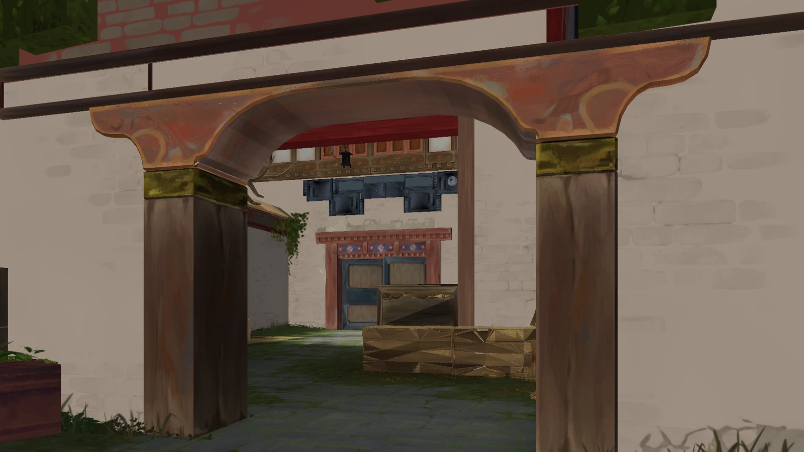
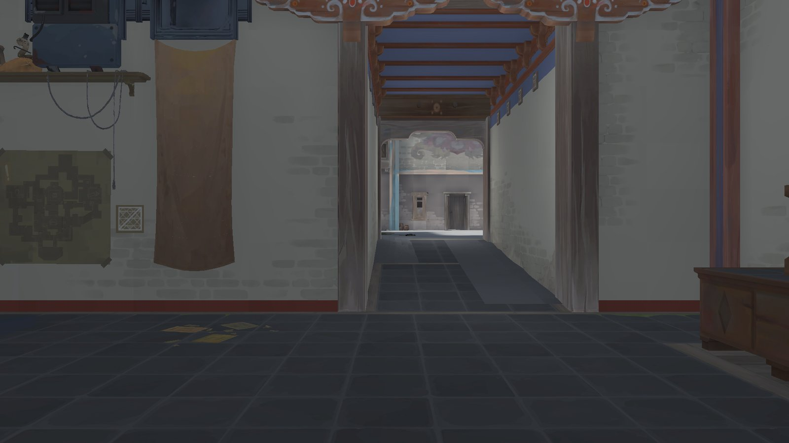
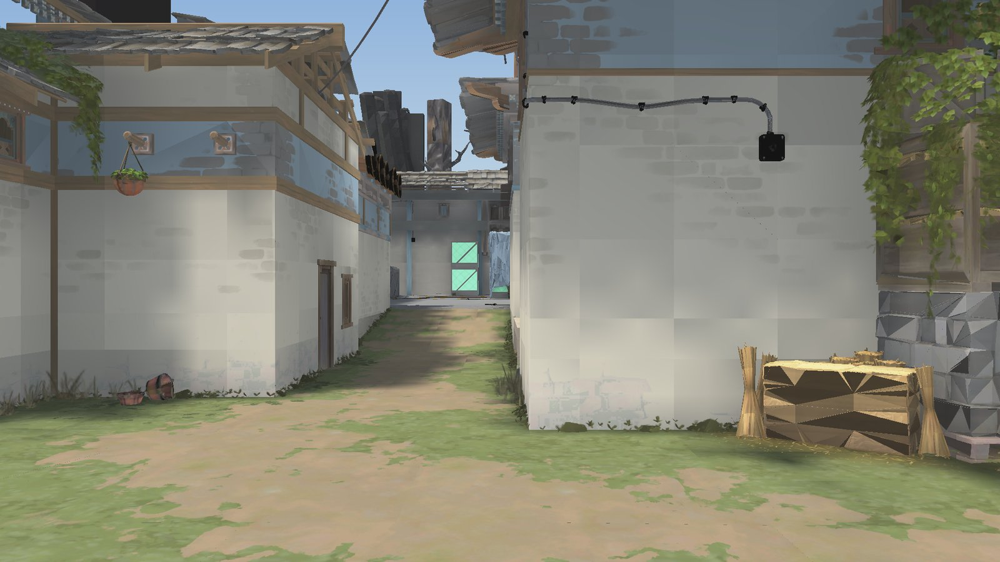
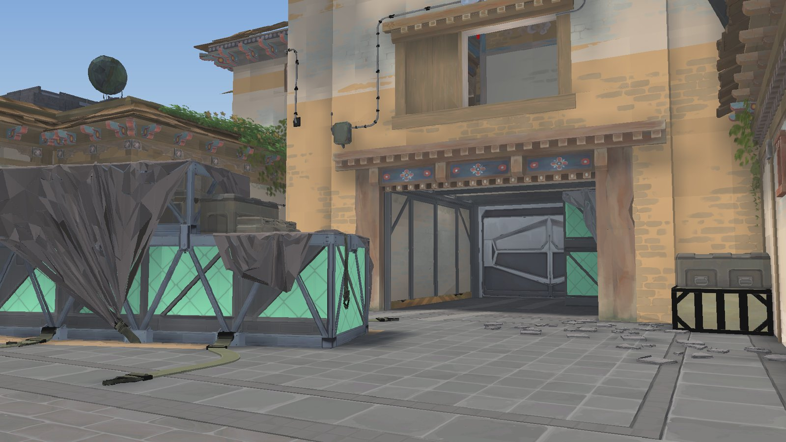
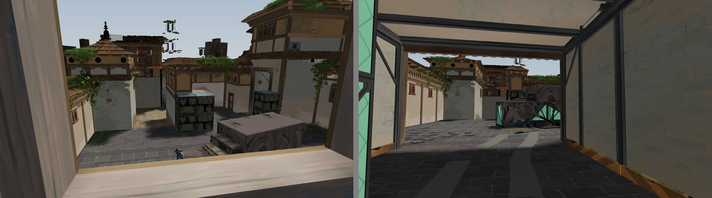
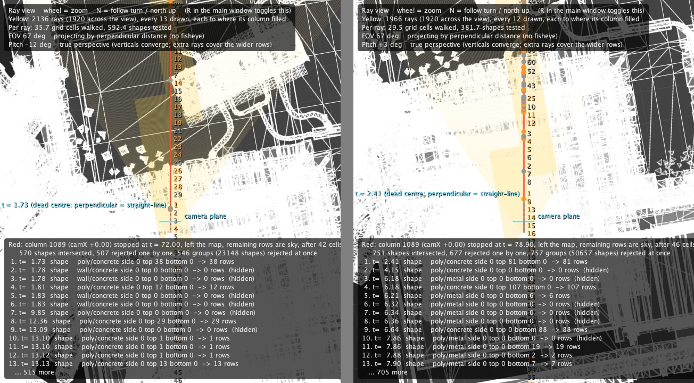

# ColumnRay

A 2.5D raycasting engine written in plain Java (Swing) with no external libraries.

The renderer casts one ray per screen column and draws each column as a vertical strip whose
height follows from the perpendicular hit distance. The world is described as a 2D plan of
regions and shapes with floor and ceiling heights, which allows stacked storeys, sloped surfaces
and textured geometry while keeping the column-based renderer.

## Features

- Column renderer with a DDA walk over a uniform acceleration grid and a bounding volume
  hierarchy per grid cell
- Multiple storeys through stacked regions, including open-air regions and floor openings
- True camera pitch, implemented as an exact projective warp of the column renderer's output
- Procedural and image textures with mip mapping and anisotropic filtering
- Baked lightmaps: sun, sky, point and panel lights, soft shadows and two bounces of indirect light,
  cached on disk and reused until the map, the settings or the bake code change
- Dynamic resolution driven by measured frame time
- Supersampled anti-aliasing
- Minimap computed from walkable space, and a top-down debug view of the rays
- Keyboard input by physical key position, independent of the active layout (macOS)

## Requirements

- JDK 22 or newer. Keys reads the physical key state through the foreign function API,
  which is a preview feature before 22
- Developed and tested on macOS. On other platforms, input falls back to AWT key events read
  as a US QWERTY layout

## Haven map

The VALORANT map shown in the screenshots below is a separate download:
**[ColumnRay-Haven](https://github.com/Arstoienn/ColumnRay-Haven)** (about 290 MB). Clone it next
to this repository and pass its map to `run.sh`:

```bash
git clone https://github.com/Arstoienn/ColumnRay.git
git clone https://github.com/Arstoienn/ColumnRay-Haven.git
cd ColumnRay
JAVA_OPTS=-Xmx12g ./run.sh ../ColumnRay-Haven/haven.json --feet 3
```

## Building and running

```bash
./run.sh
```

`run.sh` compiles `src/` into `out/` when a source file has changed (see `build.sh`) and starts
the engine with `maps/school.json`. Arguments are passed through to `engine.Main`:

```bash
./run.sh maps/school.json --size 1920x1080
./run.sh --shot a.png 16 21.6 -100 5
./run.sh --bench
```

## Command-line options

| Option | Description |
|---|---|
| `[map.json]` | Map to load (default `maps/school.json`) |
| `--size WxH` | Render resolution; the width is the number of rays per frame (default 1280x720) |
| `--window WxH` | Window size; the render is scaled to fit (default 1920x1080) |
| `--fps N` | Frame-time target for dynamic resolution; `0` disables it (default 60) |
| `--ss N` | Supersampling factor, 1-8 (default 1) |
| `--feet M` | Starting floor height in metres, e.g. to start on an upper storey |
| `--flat` | Skip the lightmap bake and use flat shading |
| `--shear` | Use y-shearing for pitch instead of the perspective warp |
| `--bench` | Time the renderer over a full turn, level and pitched 30 degrees |
| `--shot out.png [x y heading pitch [column]]` | Render one frame headlessly |
| `--shots views.txt` | Render several frames in one run, one `out.png x y feet heading` per line |

`--shot` also writes `-plain.png` (no HUD), `-albedo.png` (unshaded surface colour),
`-depth.pfm` (distance per pixel) and `-rays.png` (the ray view).

JVM system properties can be set through `JAVA_OPTS`, for example
`JAVA_OPTS=-Dlight.texel=0.5 ./run.sh`:

| Property | Description |
|---|---|
| `light.texel` | Lightmap texel size in metres |
| `light.stats` | Print lightmap bake statistics |
| `light.cache`, `light.cache.dir` | `false` bakes without the lightmap cache; the folder it is kept in (`.lightcache`) |
| `bench.warmup`, `bench.frames` | Untimed and timed frames for `--bench` (400, 720) |
| `minimap.debug` | Highlight standable ground the minimap flood did not reach |
| `grade.sat`, `grade.lift` | Colour grading parameters |

## Controls

| Input | Action |
|---|---|
| `W` `A` `S` `D` | Move |
| Mouse drag, arrow keys | Look |
| `Q` / `E` | Turn |
| `Space` / `C` / `Shift` | Jump / crouch / run |
| `G` | Fly: gravity off, Space and crouch go up and down, nothing is solid |
| `M` | Toggle minimap |
| `R` | Toggle ray view |
| `N` | Ray view: keep the player pointing up, or let the world stay put instead |
| `L` | Toggle baked lighting |
| `F` | Toggle fisheye projection (for comparison) |
| `P` | Toggle pitch model (for comparison) |
| `[` / `]` | Field of view |
| `,` / `.` | Render resolution (disables dynamic resolution) |
| `V` | Toggle dynamic resolution |
| `Esc` | Quit |

Movement keys refer to physical key positions, so they stay in place on non-QWERTY layouts.

## Maps

Maps are JSON files; `maps/school.json` documents the format in comments at the top. In summary:

- **Regions** are convex polygons with a floor height and an optional ceiling height. Regions may
  overlap to form storeys; a region without a ceiling is open to the sky.
- **Shapes** are walls (segments), circles, boxes and convex polygons with bottom and top heights.
  Tops and bottoms can be sloped.
- **Arrays** repeat a group of shapes at a fixed step.
- **Chunks** let large maps store shapes in separate files.
- **Lighting**, **textures**, **images** and the spawn point are configured per map.

## Haven

**Mid Doors**



**Garage**



**C Long**



**Flowerpot**



**Heaven and Hell**





Heaven, on the left, is the upper floor of A Tower; Hell, on the right, is the room directly below
it. Beneath each view is its ray view, the engine's top-down debug window (`R`), which draws every
column's ray over the plan of the map and lists, for the centre column, each shape the ray met and
how many rows it filled.

The map is a 64 m by 64 m section of Haven, a map from VALORANT, converted triangle by triangle
from a Blender scene: about 930,000 shapes and 408 baked material textures. It is kept in its own
repository, [ColumnRay-Haven](https://github.com/Arstoienn/ColumnRay-Haven), which has the
instructions for running it. All of the screenshots above are rendered by this engine with baked
lighting. Mid Doors, Garage and C Long are inside that section. Flowerpot, Heaven and Hell are at
A site, outside it, and were rendered from a separate conversion of that area that is not
published.

Source: [Valorant - Heaven Map](https://open3dlab.com/project/4a0d5de0-05ac-4db3-a53b-6555879bc29d/)
by AC_NONE on Open3DLab, licensed CC BY-NC-ND 4.0. See the disclaimer below.

## Benchmarking and verification

- `./bench.sh [map] [size] [runs]` runs `--bench` in several fresh JVMs and reports the median.
  Setting `CP_B` or `JAVA_OPTS_B` runs two builds or configurations alternately and reports their
  ratio.
- Changes to the renderer or lighting are expected not to alter output unless intended: `--shot`
  images, albedo and depth files, and lightmap hashes should be byte-identical before and after.

## Project layout

| Path | Contents |
|---|---|
| `src/engine/Renderer.java` | Camera, projection, grid traversal, column filling, shading |
| `src/engine/Geometry.java` | Ray intersection with segments, circles and polygons |
| `src/engine/World.java` | Regions, shapes, JSON loading, acceleration grid |
| `src/engine/Materials.java` | Procedural and image textures, filtering |
| `src/engine/Lighting.java` | Lightmap bake |
| `src/engine/LightCache.java` | Baked lightmaps on disk, keyed by the map, settings and bake code |
| `src/engine/Occluder.java` | Line of sight and nearest-hit queries |
| `src/engine/Main.java` | Window, input, player physics, HUD, command line |
| `src/engine/DynamicResolution.java` | Frame-time-driven render scaling |
| `src/engine/Minimap.java` | Minimap |
| `src/engine/RayView.java` | Top-down ray debug view |
| `src/engine/Keys.java` | Physical key state |
| `src/engine/Json.java` | JSON parser (supports `//` comments) |
| `maps/school.json` | Demo map |
| `docs/images/` | README screenshots |
| `docs/ENGINEERING.md` | Design notes, measurements and the reasoning behind each subsystem |

## License

The source code is released under the MIT License; see [LICENSE](LICENSE). The license does not
cover the Haven screenshots; see the disclaimer.

## Disclaimer

The screenshots in `docs/images/` are rendered from a map derived from "Valorant - Heaven Map" by
AC_NONE on Open3DLab (CC BY-NC-ND 4.0), which contains assets from VALORANT. The map itself is not
part of this repository; it is published separately in
[ColumnRay-Haven](https://github.com/Arstoienn/ColumnRay-Haven). VALORANT and Haven are trademarks
and copyrighted works of Riot Games, Inc. This project is not affiliated with or endorsed by Riot
Games. The screenshots are included for non-commercial demonstration only, remain the property of
their respective owners, and are not covered by this repository's MIT License.
