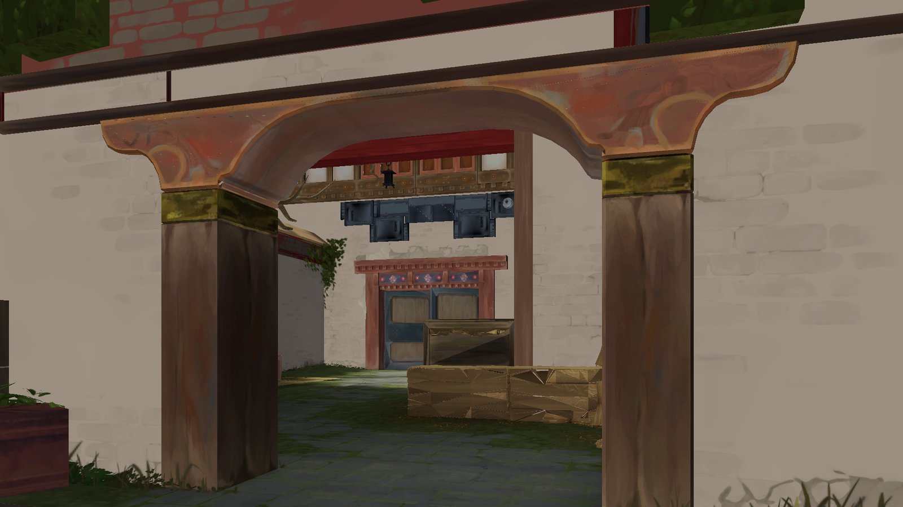

# ColumnRay

A 2.5D raycasting engine written in plain Java, with one dependency: LWJGL, which is the window
and the OpenGL entry points. Everything that decides what a frame looks like is in this repository
and depends on nothing.

The renderer casts one ray per screen column and draws each column as a vertical strip whose
height follows from the perpendicular hit distance. The world is described as a 2D plan of
regions and shapes with floor and ceiling heights, which allows stacked storeys, sloped surfaces
and textured geometry while keeping the column-based renderer.

## Features

- Column renderer with a DDA walk over a uniform acceleration grid and a bounding volume
  hierarchy per grid cell
- Multiple storeys through stacked regions, including open-air regions and floor openings
- True camera pitch up to 50 degrees, implemented as an exact projective warp of the column
  renderer's output. Only the part of the upright image the warp reads is computed: each column
  fills just the rows it is read in, and the card shades just the pixels it takes, straight into
  the tilted view
- Procedural and image textures with mip mapping and anisotropic filtering
- Reflections that keep to one ray per column. Standing water - a pool, or puddles on any floor a
  map marks as wet - reflects by walking up the column it lies in, since the ray it sends back up
  is in that column's own vertical plane. Glass shows what is behind it and reflects what is in
  front, drawn by running the same column renderer again from the eye mirrored in the pane. Both
  are in `maps/school.json`: glazing along the courtyard, and the courtyard after rain
- Baked lightmaps: sun, sky, point and panel lights, soft shadows and two bounces of indirect light,
  cached on disk and reused until the map, the settings or the bake code change
- Dynamic resolution driven by measured frame time
- Supersampled anti-aliasing
- Minimap computed from walkable space, and a top-down debug view of the rays
- Keyboard input by physical key position, independent of the active layout, on every platform:
  WASD is a shape on the keyboard and stays where it is on Colemak, Dvorak or Bopomofo

## Requirements

- JDK 22 or newer. The buffers handed to the card are allocated through the foreign function and
  memory API, which is a preview feature before 22
- LWJGL 3.4.3, fetched by `build.sh` through `lib/fetch.sh` against checksums tracked in that
  script. The jars are not committed, and a jar that does not hash as the script says it should
  is deleted rather than used, so a clone needs nothing but a JDK
- Shading on the card is the default and needs an OpenGL 3.3 core context, which GLFW asks for on
  every platform. Where the machine cannot give one - a software renderer, a virtual machine, a
  CI runner - it prints a sentence and the CPU renderer carries on, which is the whole engine.
  `--shade cpu` asks for that path on purpose. On a machine with two graphics cards, which one draws is
  Windows' per-application preference for `java.exe` (Settings > System > Display > Graphics),
  and the card it ended up on is named on the first line of the run

## The engine and the game

They are two packages, and the boundary is meant to be used rather than admired. `engine` owns the
window, the frame loop, the buffers, the renderer, the map and the bake; it has no `main`, no idea
which key walks forward, and no player. `game` owns all of that, and reaches the engine through
`Game` - four methods, of which two matter - and through the public methods on `Host`.

```java
public final class MyGame implements Game {
    private final View view = new View();

    @Override public void update(double dt, Input in) { /* move whatever moves */ }
    @Override public View view() { return view; }          // x, y, eye, heading, pitch
}
```

```java
Host host = new Host(World.load(Path.of("maps/school.json")), Options.parse(args));
host.run(new MyGame(host));
```

`Sandbox` is the game this repository ships with - walk about a map and look at it - and it is
worth reading as the worked example: about two hundred lines, none of which the engine knows
anything about. Collision against the map is `Body`, line of sight is `Occluder`, and both take
the size of the body from whoever asks, because the engine does not know how tall anybody is.

## Building and running

```bash
./run.sh
```

`run.sh` fetches LWJGL if it is missing, compiles `src/` into `out/` when a source file has
changed (see `build.sh` and `lib/fetch.sh`), and starts the game with `maps/school.json`. Arguments are passed through to `game.Main`:

```bash
./run.sh maps/school.json --size 1920x1080
./run.sh --play                            # no overlay, no toggles: just the world
./run.sh --shot a.png 16 21.6 -100 5
./run.sh --bench
```

`./run.sh` opens the sandbox: every switch the renderer has on a key, four lines of text saying
what it is doing, a minimap, and a fly mode for looking at a map from outside it. `--play` is the
same walking with none of that - no overlay, no minimap, no toggles, no flying, and the mouse
looks about without a button held. It is what to open when the point is the world rather than the
engine.

## Command-line options

| Option | Description |
|---|---|
| `[map.json]` | Map to load (default `maps/school.json`) |
| `--size WxH` | Render resolution; the width is the number of rays per frame (default 1280x720) |
| `--window WxH` | Window size; the render is scaled to fit (default 1920x1080) |
| `--fps N` | Frame-time target for dynamic resolution; `0` disables it (default 60) |
| `--ss N` | Supersampling factor, 1-8 (default 1) |
| `--feet M` | Starting floor height in metres, e.g. to start on an upper storey |
| `--fov N` | Field of view in degrees, 30-120 (default 90). Applies to the window, `--shot`, `--shots` and `--bench` alike |
| `--play` | The game with nothing on the screen but the game: no overlay, no minimap, no toggles, no flying |
| `--shade card\|cpu` | Where the frame is shaded. The card by default and three to four times faster; the CPU by default for `--verify`, `--shot` and `--shots`. `--gpu` and `--cpu` are the old spellings |
| `--hdr` | Shade in light rather than in sRGB numbers, and roll the highlights off filmically |
| `--unlit` | Skip the lightmap bake and use flat shading (`--flat` was its old name) |
| `--shear` | Use y-shearing for pitch instead of the perspective warp |
| `--bench` | Time the renderer over a full turn, level and pitched all the way up |
| `--shot out.png [x y heading pitch [column]]` | Render one frame headlessly |
| `--shots views.txt` | Render several frames in one run, one `out.png x y feet heading [pitch]` per line |
| `--verify views.txt` | Render each view and print a digest of it instead of writing files; see Tests |

`--shot` also writes `-plain.png` (no HUD), `-albedo.png` (unshaded surface colour),
`-depth.pfm` (distance per pixel) and `-rays.png` (the ray view).

JVM system properties can be set through `JAVA_OPTS`, for example
`JAVA_OPTS=-Dlight.texel=0.5 ./run.sh`:

| Property | Description |
|---|---|
| `light.texel` | Lightmap texel size in metres |
| `light.stats` | Print lightmap bake statistics |
| `light.cache`, `light.cache.dir`, `light.cache.max` | `false` bakes without the lightmap cache; the folder it is kept in (`.lightcache`); how many megabytes of bakes that folder may hold before the least recently used are dropped (2048, `0` for no limit) |
| `bench.warmup`, `bench.frames` | Untimed and timed frames for `--bench` (400, 720) |
| `minimap.debug` | Highlight standable ground the minimap flood did not reach |
| `grade.sat`, `grade.lift` | Colour grading parameters |

## Tests

```bash
./test.sh
```

Unit tests for the parts that can be checked on their own - the JSON parser, the ray/segment and
ray/polygon intersections, the frame-time controller, map loading and the lightmap cache's key -
and then two checks on whole frames:

- **Determinism.** The same build renders the seven cameras in `tests/views/school.txt` on one
  thread and on every core, and the two must agree exactly. This is the property the renderer's
  distance tie-break and the grid's cell padding exist to give, and it holds on any machine.
- **Golden frames.** The same cameras, baked and `--flat`, against digests in `tests/golden/`.
  What is hashed is the engine's own pixel, depth, albedo and lightmap arrays rather than the PNGs
  written from them, so a change to an image encoder cannot turn the test red on its own.
  `./test.sh --haven` does the same against the `maps/haven` submodule, where the map is large
  enough to exercise the acceleration structures properly; that map is private (see [Haven](#haven)).

The rule the engine is built on is that an optimisation is proved not to change the output rather
than assumed not to; the golden files are where that proof lives. A deliberate change to the
picture is blessed with `./test.sh --bless` in the same commit that causes it.
`tests/golden/README.md` explains the one thing they cannot promise - the same digests on a
different CPU - and why CI checks them on macOS only.

## Controls

Both the sandbox and `--play`:

| Input | Action |
|---|---|
| `W` `A` `S` `D` | Move |
| Mouse | Look. The pointer is hidden and captured, the way a first-person game has worked for thirty years. `Tab` hands it back in the sandbox, which needs one for hovering a column |
| Arrow keys, `Q` / `E` | Look, turn |
| `Space` / `C` / `Shift` | Jump / crouch / run |
| `Esc` | Quit |

The sandbox only, because they are switches on the engine rather than on a person:

| Input | Action |
|---|---|
| `Tab` | Hand the pointer back, so it can hover a column for the ray view |
| `G` | Fly: gravity off, Space and crouch go up and down, nothing is solid |
| `M` | Toggle minimap |
| `R` | Toggle ray view |
| `N` | Ray view: keep the player pointing up, or let the world stay put instead |
| `L` | Toggle baked lighting |
| `H` | Toggle shading in light and the filmic curve |
| `F` | Toggle fisheye projection (for comparison) |
| `P` | Toggle pitch model (for comparison) |
| `[` / `]` | Field of view |
| `,` / `.` | Render resolution (disables dynamic resolution) |
| `V` | Toggle dynamic resolution |

Movement keys refer to physical key positions, so they stay in place on non-QWERTY layouts.

The walk has a velocity in it rather than a speed: it accelerates to pace in about 70 ms and stops
about as quickly, a jump keeps the momentum it left the ground with, and a jump asked for just
after walking off an edge or just before landing is still a jump. The camera bobs a couple of
centimetres with the stride and dips when a fall lands, which is how a first-person view reports
speed at all. None of it moves the player differently from where the physics says they are, and
none of it reaches a screenshot: `Player.cameraMotion` is the switch, and a placed camera is level.

## Maps

Maps are JSON files; `maps/school.json` documents the format in comments at the top. In summary:

- **Regions** are convex polygons with a floor height and an optional ceiling height. Regions may
  overlap to form storeys; a region without a ceiling is open to the sky.
- **Shapes** are walls (segments), circles, boxes and convex polygons with bottom and top heights.
  Tops and bottoms can be sloped.
- **Arrays** repeat a group of shapes at a fixed step.
- **Chunks** let large maps store shapes in separate files.
- **Lighting**, **textures**, **images** and the spawn point are configured per map.

## Haven

A section of VALORANT's Haven converted for this engine, shown here because it is the map that
works the engine hardest: 930,000 shapes, several storeys and a bake of a quarter of an hour.
**The map itself is not published.** It is derived from a work licensed CC BY-NC-ND, which allows
no derivatives to be shared, and from assets that belong to Riot Games; see [Copyright](#copyright).
It sits in a private repository, pulled in at `maps/haven` as a submodule, so a clone of this
repository has an empty `maps/haven` and does not need it - `maps/school.json` exercises every
subsystem.

**Mid Doors**



**Heaven and Hell**


Heaven, on the left, is the upper floor of A Tower; Hell, on the right, is the room directly below
it. Beneath each view is its ray view, the engine's top-down debug window (`R`), which draws every
column's ray over the plan of the map and lists, for the centre column, each shape the ray met and
how many rows it filled.

## Street

A night street after rain, converted from a free model: old apartment blocks with shopfronts and
graffiti against a backdrop of panel towers, thirteen street lamps, and a wet road whose puddles
reflect the street by walking up the column they lie in. 44,786 shapes; the bake takes about
fifteen seconds. The map is not published, because the model's licence does not allow its files to
be shared; see [Copyright](#copyright).


## Benchmarking and verification

- `./bench.sh [map] [size] [runs]` runs `--bench` in several fresh JVMs and reports the median.
  Setting `CP_B` or `JAVA_OPTS_B` runs two builds or configurations alternately and reports their
  ratio.
- Changes to the renderer or lighting are expected not to alter output unless intended: `--shot`
  images, albedo and depth files, and lightmap hashes should be byte-identical before and after.

## Project layout

| Path | Contents |
|---|---|
| `src/engine/Renderer.java` | Camera, projection, grid traversal, column filling, shading |
| `src/engine/Geometry.java` | Ray intersection with segments, circles and polygons |
| `src/engine/World.java` | Regions, shapes, JSON loading, acceleration grid |
| `src/engine/Materials.java` | Procedural and image textures, filtering |
| `src/engine/Srgb.java` | What an sRGB number is as light; read by the renderer and by the bake |
| `src/engine/Lighting.java` | Lightmap bake |
| `src/engine/LightCache.java` | Baked lightmaps on disk, keyed by the map, settings and bake code |
| `src/engine/Occluder.java` | Line of sight and nearest-hit queries |
| `src/engine/Body.java` | What the map lets a body of a given size stand on, and what blocks it |
| `src/engine/Host.java` | Window, frame loop and buffers: the engine a game runs on |
| `src/engine/Game.java` | What a game implements: update, view, overlay |
| `src/engine/View.java` | Where to look from, in metres and radians |
| `src/engine/Input.java` | Keys and mouse, with no bindings in them |
| `src/engine/Options.java` | Command line |
| `src/engine/Warp.java` | The pitch warp, and which part of the upright image it reads |
| `src/engine/GpuWarp.java` | The tilted view on the card, which the window draws without reading it back |
| `src/engine/Capture.java` | Headless modes: `--bench`, `--shot`, `--shots`, `--verify` |
| `src/engine/DynamicResolution.java` | Frame-time-driven render scaling |
| `src/engine/Minimap.java` | Minimap |
| `src/engine/RayView.java` | Top-down ray debug view |
| `src/engine/Keys.java` | Key positions, which the window answers |
| `src/engine/Surface.java` | The window seam: where the picture goes and the controls come from |
| `src/engine/SurfaceGlfw.java` | The GLFW window: the picture, the pointer, the keys, the ray view |
| `src/engine/Glfw.java` | The library's lifetime and the hidden window that owns the engine's context |
| `src/engine/Gl.java` | OpenGL through LWJGL, and the context the card path draws in |
| `src/engine/Gpu*.java`, `GlMaterials.java` | Shading on the card: spans, walls, masks, materials, textures, lightmaps |
| `src/engine/GpuNote.java` | Says when a machine has a second graphics card the frame did not go to |
| `src/engine/GpuCheck.java`, `GpuMatCheck.java` | How far the card's picture and materials are from the CPU's |
| `src/engine/Hash.java` | Digests for the golden test |
| `src/engine/Json.java` | JSON parser (supports `//` comments) |
| `src/game/Main.java` | Where a run starts: command line, map, engine, then play or capture |
| `src/game/Walker.java` | The walking both games share: the body, the bindings, the camera |
| `src/game/Sandbox.java` | The sandbox: bindings, toggles, the camera it hands the engine |
| `src/game/Play.java` | `--play`: the same walking with nothing drawn over it |
| `src/game/Player.java` | Movement, gravity, crouch, jump, and what the camera does about them |
| `src/game/Hud.java` | Overlay text and minimap drawing |
| `maps/school.json` | Demo map |
| `maps/haven/` | Submodule: the Haven map, in a private repository (see [Haven](#haven)) |
| `docs/images/` | README screenshots |
| `docs/ENGINEERING.md` | Design notes, measurements and the reasoning behind each subsystem |

## License

The source code is released under the MIT License; see [LICENSE](LICENSE). The license covers the
code and `maps/school.json`, and nothing else: not the screenshots of other maps in `docs/images/`,
and not those maps. See [Copyright](#copyright).

## Copyright

Only the engine and the school map are this project's own work. The other maps shown here are
conversions of other people's work, and their files are deliberately kept out of every public
repository.

**Haven.** The Haven screenshots are rendered from a map derived from
["Valorant - Heaven Map"](https://open3dlab.com/project/4a0d5de0-05ac-4db3-a53b-6555879bc29d/) by
AC_NONE on Open3DLab, licensed CC BY-NC-ND 4.0, which contains assets from VALORANT. That licence
does not permit sharing a derivative, so the converted map is not distributed: it is in a private
repository and is not available on request. VALORANT and Haven are trademarks and copyrighted works
of Riot Games, Inc. This project is not affiliated with or endorsed by Riot Games. The screenshots
are shown for non-commercial demonstration only, remain the property of their respective owners,
and are not covered by this repository's MIT License.

**Street.** The street screenshots are rendered from a map converted from
["street city (7) for games FREE"](https://sketchfab.com/3d-models/street-city-7-for-games-free-493a69b451284ff88346c7b3e4e1b5a7)
by dasy444 on Sketchfab, used under the Sketchfab Free Standard license. That license allows
renders to be published but not the model, or a conversion of it, to be distributed as files, so
the map is not part of any public repository. The screenshots are not covered by this repository's
MIT License.
