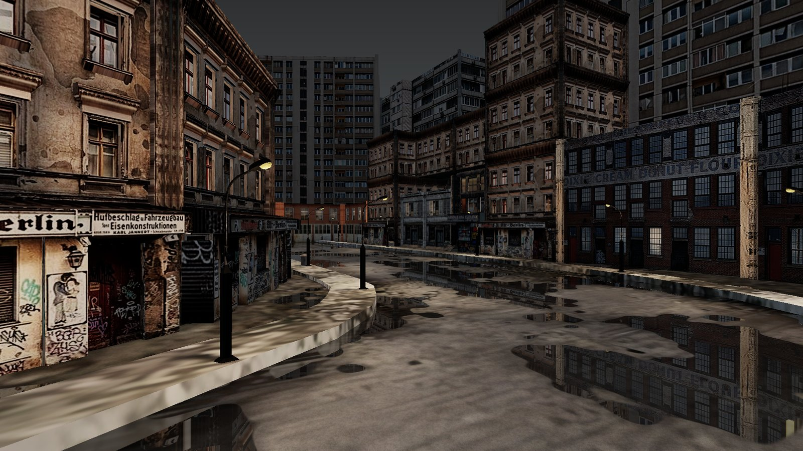
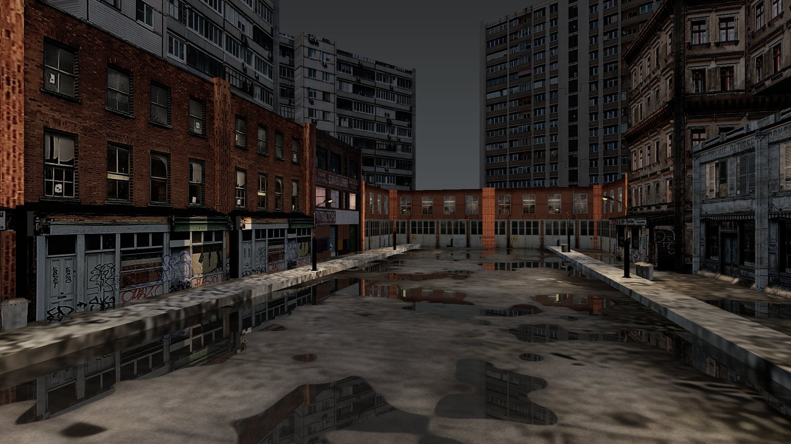
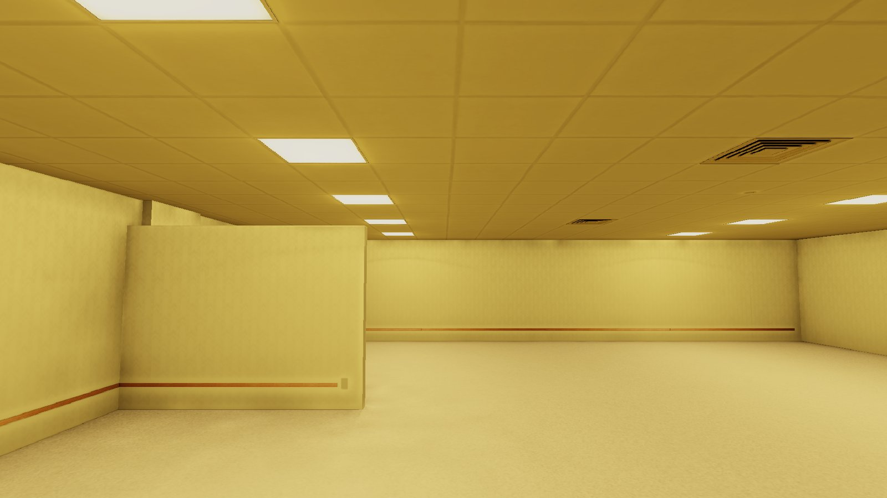
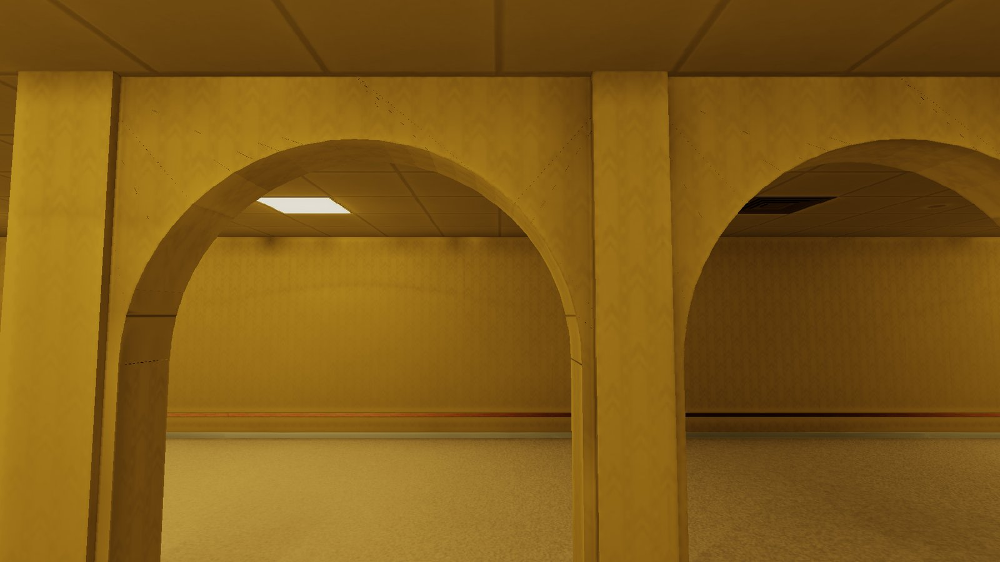
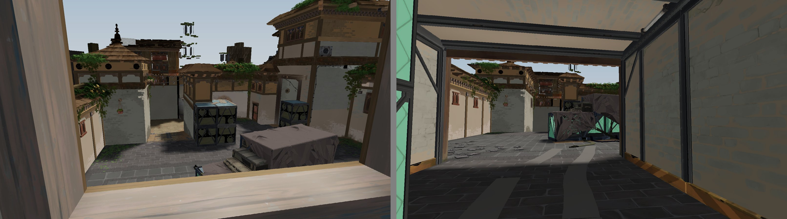
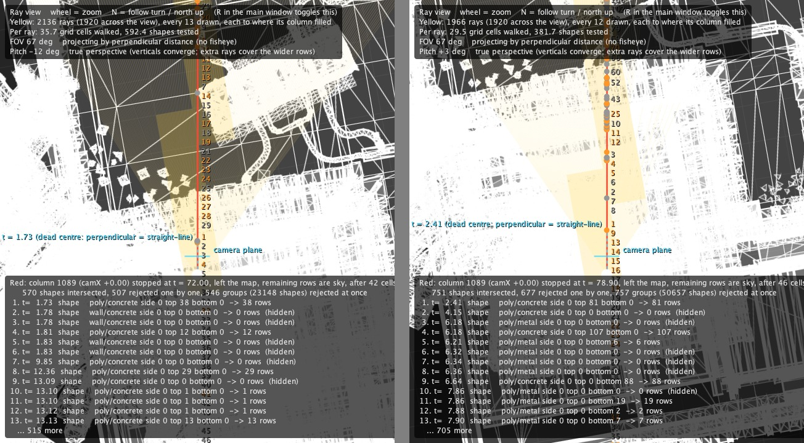

# Maps

The three converted maps, with pictures from each - every one a frame from the engine, one ray per
screen column, rendered at 1920x1080 with `--hdr` - and then the map format. The Backrooms can be
run by anybody; Haven and the night street can only be shown. Back to the [README](../README.md).

## A night street

A night street after rain, converted from a free model: old apartment blocks with shopfronts and
graffiti against a backdrop of panel towers, thirteen street lamps, and a wet road whose puddles
reflect the street by walking up the column they lie in. 47,311 shapes; the bake takes about
twenty seconds. The map is not published, because the model's licence does not allow its files to
be shared; see [Copyright](COPYRIGHT.md).





## The Backrooms

The Backrooms, Level 0: 86 by 25 metres of yellow wallpaper, carpet and ceiling tiles under
fifty-four fluorescent panels, converted from a CC BY model. It is the converted map anybody can
run, and the one that shows the engine's flickering lights - three of its lamps stutter every so
often and one has gone out, each taking its share of the bounced light and its own panel's glow
with it. It lives in its own repository,
[ColumnRay-Backrooms](https://github.com/Arstoienn/ColumnRay-Backrooms), as the submodule
`maps/backrooms`:

```bash
git submodule update --init maps/backrooms
./run.sh maps/backrooms/backrooms.json --hdr --play
```

The first run bakes the light in about a minute.





## Haven

A section of VALORANT's Haven converted for this engine, shown here because it is the map that
works the engine hardest: 930,000 shapes, several storeys and a bake of a quarter of an hour.
**The map itself is not published.** It is derived from a work licensed CC BY-NC-ND, which allows
no derivatives to be shared, and from assets that belong to Riot Games; see [Copyright](COPYRIGHT.md).
It sits in a private repository, pulled in at `maps/haven` as a submodule, so a clone of this
repository has an empty `maps/haven` and does not need it - `maps/school.json` exercises every
subsystem.



Heaven, on the left, is the upper floor of A Tower; Hell, on the right, is the room directly below
it. Beneath them is each view's ray view, the engine's top-down debug window (`R`), which draws
every column's ray over the plan of the map.



## The map format

Maps are JSON files; `maps/school.json` documents the format in comments at the top. In summary:

- **Regions** are convex polygons with a floor height and an optional ceiling height. Regions may
  overlap to form storeys; a region without a ceiling is open to the sky.
- **Shapes** are walls (segments), circles, boxes and convex polygons with bottom and top heights.
  Tops and bottoms can be sloped.
- **Arrays** repeat a group of shapes at a fixed step.
- **Chunks** let large maps store shapes in separate files.
- **Lighting**, **textures**, **images** and the spawn point are configured per map.

Every key, with the reasoning behind it, is under "Map format" in [Engineering](ENGINEERING.md#map-format).
